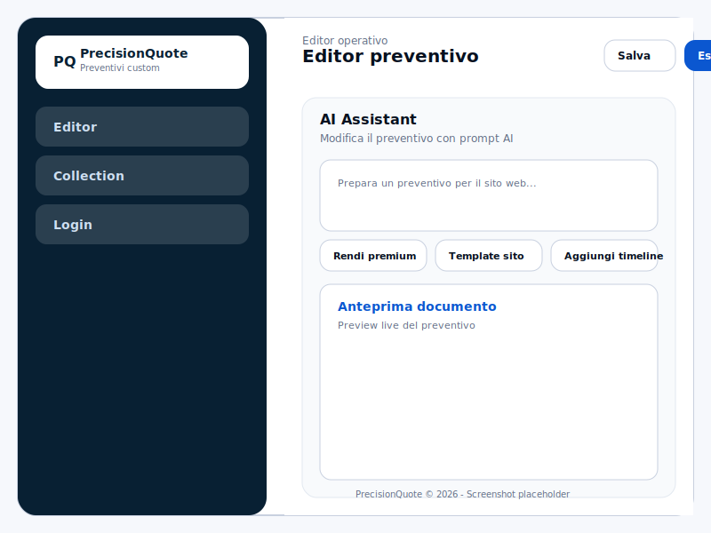
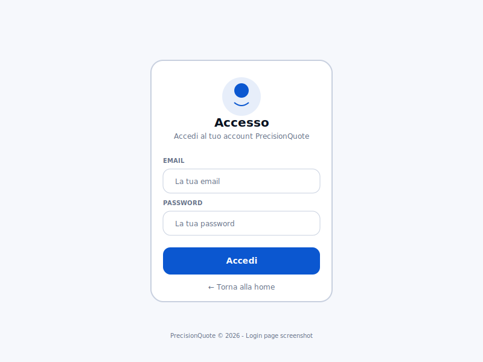
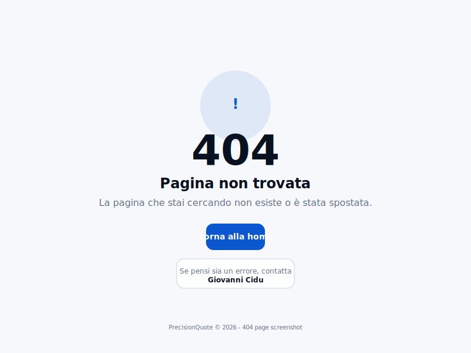

# Preventivi Custom App

Prototipo React/SaaS in italiano per creare, personalizzare, salvare e gestire preventivi professionali. Il prodotto è centrato sull'editor: ogni parte del preventivo può essere modificata manualmente oppure tramite un assistente AI applicativo, stile Claude Design, che aggiorna davvero contenuti, voci, colore e struttura del documento.



## Cosa include

- **Editor core preventivo**: campi cliente, titolo, IVA, testi, sezioni e voci economiche modificabili.
- **AI co-editor applicativa**: prompt rapidi e input libero per applicare cambiamenti visibili al preventivo, non solo messaggi in chat.
- **Anteprima documento tipo PDF**: superficie A4-like con totali live, sezioni e colore brand.
- **Personalizzazione manuale**: 10 preset colore e 10 preset stile documento come base iniziale.
- **Collection**: lista dei preventivi salvati con azioni modifica, duplica ed elimina.
- **Persistenza locale mock**: i preventivi vengono salvati in `localStorage` per simulare un flusso reale.
- **Autenticazione**: pagina di login con form email/password e persistenza token.
- **Gestione errori**: pagina 404 personalizzata per route non trovate.

## Navigazione

- `/` — Editor preventivo, area principale del prodotto.
- `/collection` — Raccolta preventivi salvati.
- `/login` — Pagina di accesso con form email/password.
- `*` — Pagina 404 per route non trovate.





Non è prevista una dashboard: in questa fase il focus resta su creazione, modifica e gestione dei preventivi.

## Struttura progetto

```text
SitoPreventivo/
├── App.jsx                    # Prototipo principale self-contained per il runner JSX
├── index.html                 # Shell HTML locale con favicon
├── favicon.svg                # Icona locale per evitare 404 favicon
├── DESIGN.md                  # Baton del design system
├── README.md                  # Documentazione progetto
├── .well-known/appspecific/com.chrome.devtools.json
├── screenshots/               # Screenshot dell'applicazione
│   ├── editor-preview.png
│   ├── login-page.png
│   └── 404-page.png
└── src/                       # Componenti modulari e pagine
    ├── main.jsx               # Entry point con routing React Router
    ├── pages/
    │   ├── LoginPage.jsx      # Pagina di login
    │   └── NotFoundPage.jsx   # Pagina 404
    └── components/            # Componenti UI esistenti
```

## Avvio locale

```bash
# Installa dipendenze
npm install

# Avvia server di sviluppo
npm run dev
```

Il server sarà disponibile su `http://localhost:5173`. Naviga tra le route:
- `http://localhost:5173/` — Editor principale
- `http://localhost:5173/login` — Pagina di login
- `http://localhost:5173/non-existent` — Pagina 404


## Design system

`DESIGN.md` è il baton del sistema visivo: colori, tipografia, spacing, componenti e controlli EDITMODE devono restare coerenti con quel file.

## Screenshot

### Editor Preview

L'editor principale con controllo AI, campi manuali e anteprima documento live.

### Login Page

Form di login con email e password, design pulito e accessibile.

### 404 Page

Pagina di errore personalizzata con link per tornare alla home.

## Prossimi step consigliati

- Definire esportazione PDF client-side o server-side.
- Aggiungere gestione clienti/anagrafiche.
- Rendere le sezioni del documento riordinabili.
- Collegare la Collection a dati reali o backend.
- Raffinare il comportamento dell'AI per operazioni più granulari.

## Stato modularizzazione componenti

- `src/components/Layout.jsx`, `Topbar.jsx`, `Icon.jsx`, `EditorView.jsx`, `DocumentPreview.jsx` e `CollectionView.jsx` sono stati preparati come componenti modulari reali.
- Il routing è configurato con `react-router-dom` in `src/main.jsx`.
- Le pagine `LoginPage.jsx` e `NotFoundPage.jsx` sono complete e funzionanti.
- `App.jsx` esporta il componente e il contesto per supportare le pagine modulari.
- Step consigliato per sviluppo locale: continuare a spostare la logica dati da `App.jsx` verso i componenti modulari già creati.
